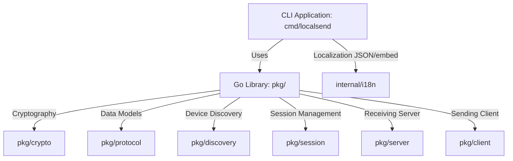

# LocalSend Go Library & CLI Architecture Design Document

---

### Language Links
- [日本語 (Japanese)](architecture_ja.md)
- **English**

---

This document defines the overall design, module structure, and specifications of the Go library and CLI tool implementing the LocalSend protocol.

---

## 1. System Overview & Component Responsibilities

The project is strictly separated into two parts: the "Go Library" which implements the core communication logic, and the "CLI Tool" which handles user interactions and system-specific integrations.



### 1.1 Go Library (`pkg/`) Design Principles
- **English-Only**: All code comments, GoDoc, error messages, and log messages in this package must be written in **English**.
- **Low Dependencies**: Keep external dependencies to a minimum. Use Go's standard library (`net`, `net/http`, `crypto`, `encoding/json`, etc.) as much as possible.
- **Safe I/O**: File transfers are handled via streaming (`io.Copy`-based) to avoid loading entire files into memory, keeping memory consumption low during large file transfers.

### 1.2 CLI Tool (`cmd/localsend/`) Design Principles
- **Localization (i18n)**: Supports English (default fallback) and Japanese. Translation files are maintained as raw JSON files and compiled into the Go binary.
- **Advanced Network Control**: Supports proxy settings (such as Mitmproxy for traffic interception), option to skip TLS verification (`--insecure`), and loading custom CA certificates (`--ca`) for debugging and testing.

---

## 2. Go Library Modules

### 2.1 TLS Certificate Generation & Persistence (`pkg/crypto`)
LocalSend uses HTTPS for secure transmission. The application generates a self-signed TLS certificate dynamically in memory or loads it from a local cache.

- **TOFU Warning Mitigation & Responsibility Split**:
  Generating a new certificate on every run causes other devices to show a security warning because the certificate fingerprint changes. To prevent this, the library supports persistence of TLS credentials.
  - **`LoadOrGenerateCredentials(certPath, keyPath string) (*CertificateInfo, error)`**:
    - If the paths are provided and files exist, it loads the certificate from the disk.
    - Otherwise, it generates a new RSA 2048-bit key and a self-signed certificate (valid for 10 years, CN=localsend), saves them to the specified paths, and loads them in-memory.
  - **Library/CLI Split**:
    - The library (API) provides the helper functions for loading, generating, and saving.
    - The decision of whether to persist (cache) the credentials, and the destination file path (e.g. `~/.config/localsend/`), is the sole responsibility of the calling application (the CLI or any other custom software utilizing the API). Users can still opt to run in-memory only by calling the generation function directly.

### 2.2 Data Models & Error Types (`pkg/protocol`)
Defines the standard LocalSend structures and custom errors to ease handling in the CLI.

- **Model Separation**:
  - `Device`: The basic structure representing a peer device.
  - `AnnounceMessage`: Temporary structure used for UDP multicast discovery containing the `announce` field.
- **Custom Error Types**:
  ```go
  var (
      ErrRejected         = errors.New("transfer rejected by receiver")
      ErrInvalidPIN       = errors.New("invalid or missing PIN")
      ErrSessionBusy      = errors.New("receiver is busy with another session")
      ErrDeviceNotFound   = errors.New("target device not found")
      ErrTransferCanceled = errors.New("transfer canceled")
  )
  ```

### 2.3 Discovery Mechanism (`pkg/discovery`)
1. **UDP Multicast**:
   - The receiver enables `SO_REUSEADDR` (or equivalent socket controls in Go) to prevent conflicts between the listener and broadcaster on port `53317`.
   - **Self-Echo Suppression**: If the received announcement payload's `fingerprint` matches the node's own fingerprint, the packet is discarded immediately.
2. **HTTP Legacy Scan (`ScanLegacy`)**:
   - Performs a legacy scan by sending HTTP POST requests to `/api/localsend/v2/register` across the local C-class subnet (up to 255 addresses).
   - **Resource Control**: Employs a buffered channel (size 64) as a semaphore to limit concurrent requests to 64, avoiding goroutine leaks.
   - **Timeout**: Enforces a strict **500ms** connection timeout via `context.WithTimeout` per host.

### 2.4 Session Manager (`pkg/session`)
Manages active upload sessions in a thread-safe manner.

- **Thread-Safety**:
  - Each `UploadSession` features a `sync.Mutex` to coordinate updates (e.g., bytes transferred, file status) during concurrent uploads.
  - The `Manager` holds a `sync.Map` of `SessionID -> *UploadSession` to ensure safe access.
- **Session Timeout**:
  - Sessions timeout after **10 minutes** of inactivity (no read/write actions) and are cleaned up by a background cleaner.

### 2.5 Receiving Server (`pkg/server`)
- **Hybrid mTLS Compliance & Status Verification**:
  - The receiving server runs with TLS client authentication configured as `tls.VerifyClientCertIfGiven` to accommodate official clients.
  - If a client presents a certificate, the server validates its hash against the fingerprint received in `/prepare-upload`. The verification outcome is flagged in the session state (`ClientVerified = true/false`).
  - **`StrictTLS` Option**:
    - If `StrictTLS: true` is configured, connections that do not present a client certificate or fail the fingerprint validation are blocked at the TLS or HTTP level (returning `403 Forbidden`). Default is `false` to keep compatibility with official apps.
  - **Other Validations**:
    - The server verifies client authenticity by validating that the `sessionId` and file `token` supplied in `/upload` match those assigned during `/prepare-upload`.
    - It also validates that the client's source IP address during `/upload` matches the IP address from which `/prepare-upload` was initiated.
    - **Duplicate Skipping (204 No Content)**: If all requested files already exist (same name and size) in the save directory during `/prepare-upload`, the server immediately returns `204 No Content` to allow the sender to skip the transfer.
    - **Partial Acceptance**: The `OnPrepareUpload` callback supports accepting only a subset of files. File tokens are only generated for accepted files, and the client skips sending the rejected ones.
    - **Async Cancel Detection & Cleanup**: If a session cancellation is detected during file upload, the server immediately stops receiving and deletes the partially written temporary file.
- **Download API (Reverse Transfer)**:
  - Hosts a separate **HTTP-only listener** (unencrypted) on a separate/dynamic port for browser compatibility.
  - **[Design Decision - Rationale for HTTP-only Web Share]**:
    Although the official app provides an "Encryption (HTTPS)" option for Web Share, this Go implementation intentionally limits the Web Share server to **HTTP-only**. This aligns with the core protocol specification (v2.1) to avoid browser security warnings (e.g., "Your connection is not private") caused by self-signed certificates on local IP addresses. To secure web transfers, the protocol-defined "PIN code requirement" option should be used instead.
  - **PIN Verification & Form Delivery**: If a PIN is configured, the server prompts web clients with a PIN entry page (Web UI). On success, it sets a `session_pin` Cookie to grant access. The API (`/prepare-download` etc.) also verifies this PIN/Cookie.
  - **On-Demand Activation**: To prevent unnecessary port usage, the HTTP server is only launched when a web transfer is explicitly initiated (e.g., via the CLI's web send command) and is shut down once the transfer ends.
  - Prevents filename corruption for non-ASCII characters by returning a correctly formatted `Content-Disposition: attachment; filename*=UTF-8''...` header.

### 2.6 Sending Client (`pkg/client`)
- **Partial Failure Handling**:
  - Returns a slice of `SendResult` to report status for each file individual upload.
  ```go
  type SendResult struct {
      FileID string
      Err    error
  }

  func (c *Client) SendFiles(ctx context.Context, target *protocol.Device, files []SendFileSource, progress func(fileID string, sentBytes int64)) ([]SendResult, error)
  ```
  *Note: Critical session errors (such as rejection in `/prepare-upload`) are returned as the second return value `error`.*

---

## 3. CLI Design

### 3.1 Commands

1. **`localsend receive`**:
   - Starts the server and listens for incoming transfers.
   - **Flags**:
     - `--port <port>`: Port to listen on (default: 53317)
     - `--no-tls`: Run in HTTP mode (unencrypted)
     - `--alias <name>`: Override the default device alias
     - `--tls-strict`: Require mutual TLS verification (mTLS) for all incoming connections. Default is false.
2. **`localsend send <file/folder paths...>`**:
   - Scans the network, prompts the user to select a device, and uploads files.
   - **Flags**:
     - `--target <IP:Port>`: Bypass discovery and send directly to target
     - `--yes`: Bypass confirmation prompts (non-interactive mode, useful for CI/CD)
     - `--proxy <URL>`: Set HTTP/HTTPS proxy (e.g., `http://127.0.0.1:8080`)
     - `-k, --insecure`: Ignore TLS certificate verification errors
     - `--ca <path>`: Path to a custom CA certificate file
3. **`localsend scan`**:
   - Scans the network and lists active LocalSend devices, then exits.
   - **Flags**:
     - `--json`: Format the output as a JSON payload for scripting and automation
     - `--timeout <seconds>`: Scan duration (default: 2.5 seconds)

### 3.2 Exit Codes
Enforces strict exit codes for scripting and program integration.

| Code | Meaning |
|------|---------|
| `0`  | Success |
| `1`  | Generic System Error |
| `2`  | Device Not Found (during scan or targeting) |
| `3`  | Rejected by the receiver's user or server |
| `4`  | Transfer Failed (network drop during transfer) |

### 3.3 Multilingual Support (i18n)
- Translation strings are managed cleanly via JSON files (`internal/i18n/en.json` and `internal/i18n/ja.json`).
- These JSON files are statically embedded into the Go binary using `//go:embed`, ensuring a single-binary distribution without external runtime dependencies.
- Language selection is determined in order by the `--lang` flag, `LANG`/`LC_ALL` environment variables, or the OS default locale.
