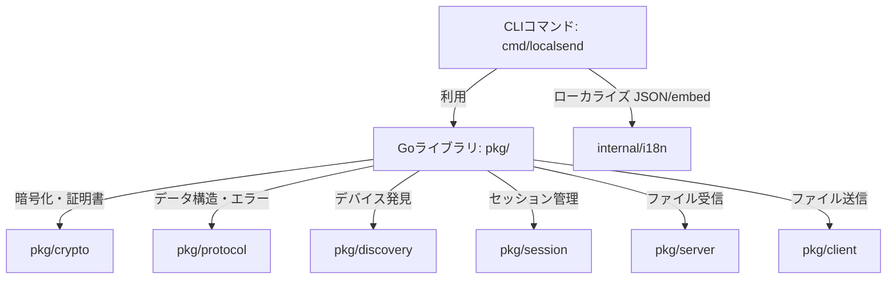

# LocalSend Go ライブラリ & CLI アーキテクチャ設計書

---

### 言語リンク
- **日本語**
- [English (英語)](architecture.md)

---

本ドキュメントは、Go言語によるLocalSendプロトコルのライブラリ実装およびCLIツールの全体設計・モジュール構造を定義する日本語のアーキテクチャ設計書です。

---

## 1. 全体方針と責務分割

本プロジェクトは、他デバイスと通信するコアラジックを「ライブラリ」、ユーザーとのインターフェースを提供するコマンドラインツールを「CLI」として明確に分離します。



### 1.1 Goライブラリ (`pkg/`) の設計方針
- **英語のみ**: ソースコード内のすべてのコメント、ドキュメンテーション（GoDoc）、エラーメッセージ、ログは**英語**で記述します。
- **低依存性**: 外部ライブラリへの依存を最小限に抑え、Go標準ライブラリ（`net`, `net/http`, `crypto`, `encoding/json` 等）を主に使用します。
- **安全なI/O**: ファイル転送にはメモリ展開を防ぐストリーミング（`io.Copy` ベース）を徹底し、大容量ファイル転送時の省メモリ性を確保します。

### 1.2 CLI (`cmd/localsend/`) の設計方針
- **多言語対応 (i18n)**: 英語（デフォルト）と日本語をサポートします。多言語辞書は外部のJSONファイルとして分離し、ビルド時にバイナリへ埋め込みます。
- **デバッグ容易性**: Mitmproxyなどのデバッグプロキシとの接続や、オレオレ証明書の検証無視（`--insecure`）、カスタムCA（`--ca`）のロードといった高度なネットワーク制御に対応します。

---

## 2. Goライブラリのモジュール詳細

### 2.1 証明書のロードと動的生成 (`pkg/crypto`)
LocalSendのHTTPS通信には、各デバイスが生成する自己署名証明書が必要です。

- **役割分担とキャッシュ対応**:
  - 毎起動時に証明書を新規生成すると、通信相手から「新しいデバイス」と誤認されセキュリティ警告（TOFU警告）が表示されます。これを防ぐため、本ライブラリは証明書のファイルロード・保存のヘルパーを提供します。
  - **`LoadOrGenerateCredentials(certPath, keyPath string) (*CertificateInfo, error)`**:
    - パスが指定され、かつファイルが存在する場合はディスクからロードします。
    - 存在しない場合は、新規に RSA 2048-bit 鍵と自己署名証明書（10年有効）を生成し、指定されたパスに保存した上でインメモリに展開します。
  - **APIとCLIの切り分け**:
    - ライブラリ（API）は上記ロード/生成機能の両方を提供します。
    - 実際にファイルをキャッシュとして保存するかどうか、およびその保存先パス（例: `~/.config/localsend/` 等）の決定は、CLIやライブラリを呼び出す個々のソフトウェア側の責務とします。保存を行わない場合は、インメモリ生成関数を直接利用できます。

### 2.2 データモデルとエラー体系 (`pkg/protocol`)
LocalSendプロトコルのデータ型と、CLI等でハンドリングしやすい独自エラーを定義します。

- **モデルの分割**:
  - `Device`: メモリ上や接続相手として管理する基本構造体。
  - `AnnounceMessage`: UDPマルチキャスト専用のJSONメッセージ（`announce` フィールドを含める）。
- **独自エラー型**:
  ```go
  var (
      ErrRejected         = errors.New("transfer rejected by receiver")
      ErrInvalidPIN       = errors.New("invalid or missing PIN")
      ErrSessionBusy      = errors.New("receiver is busy with another session")
      ErrDeviceNotFound   = errors.New("target device not found")
      ErrTransferCanceled = errors.New("transfer canceled")
  )
  ```

### 2.3 デバイス検出メカニズム (`pkg/discovery`)
本実装では、以下の3つのディスカバリモード（`--discovery-mode`）をサポートし、環境に合わせたプロトコルの切り替えが可能です。

*   **`hybrid` (デフォルト)**: UDPマルチキャスト、mDNS、HTTPレガシースキャンをすべて同時に実行します。
*   **`multicast`**: 従来のLocalSend互換として、UDPマルチキャストとHTTPレガシースキャンを実行します。
*   **`mdns`**: 標準的なmDNS/DNS-SDのみを実行します。

それぞれのメカニズムの動作設計は以下の通りです。

1. **UDPマルチキャスト**:
   - リスナーはソケットバインド時に `SO_REUSEADDR` 等（Goの `net.ListenPacket` に準ずるバインド制御）を有効にし、同一ポートでの送受信競合を防ぎます。
   - **自己ループ（Self-Echo）の抑制**: 受信したアナウンスパケットの `fingerprint` が自身のものと一致する場合は、処理を行わずに即座に破棄します。
2. **mDNS / DNS-SD (`pkg/discovery/mdns.go`)**:
   - `github.com/pion/mdns/v2` を用いて、`_localsend._tcp.local` サービスを公開（Register）および探索（Browse）します。
   - 他プロセスとのポート共有のため、`5353` ポートのバインド時に `SO_REUSEADDR` を適用します。
   - デバイス情報はTXTレコード（`alias`, `version`, `deviceModel`, `deviceType`, `fingerprint`, `protocol`, `download`）にエンコードして伝達されます。
3. **HTTPレガシースキャン (`ScanLegacy`)**:
   - マルチキャストが通らない環境向けに、ローカルCクラスサブネット（最大255アドレス）へ並行でHTTP POSTを送ります。
   - **実行制限**: mDNSのみを動作させる `mdns` モード時は、不要なネットワークスキャンを避けるため実行されません。
   - **リソース制御**: バッファ付きチャネル（サイズ64）をセマフォとして使用し、同時並行数を64に制限してゴルーチンリークを防ぎます。
   - **タイムアウト**: `context.WithTimeout` を使用し、各ホストへの接続制限時間を **500ms** とします。

### 2.4 セッションマネージャ (`pkg/session`) とスレッドセーフ
並行アクセスからセッション状態を保護するマネージャクラスです。

- **スレッドセーフ**:
  - 各 `UploadSession` に `sync.Mutex` を搭載し、複数ファイルの並行アップロード処理に伴う転送済みサイズや完了状態の更新を排他制御します。
  - `Manager` は `sync.Map` を用いて、複数の `SessionID -> *UploadSession` をスレッドセーフに保持します。
- **セッションタイムアウト**:
  - セッションの生存期間は **10分** とし、最後のアクセス（アップロード等）から10分経過したセッションはバックグラウンドのクリーンアップタイマーによって自動破棄されます。

### 2.5 受信サーバー (`pkg/server`)
- **ハイブリッド mTLS と認証状態の保持**:
  - 公式クライアント（mTLS非対応）との通信を維持しつつ、セキュアな検証を行うため、TLS設定の `ClientAuth` は `tls.VerifyClientCertIfGiven` で起動します。
  - クライアントが証明書を提示した場合、接続確立後にそのハッシュ値と `/prepare-upload` 時の `fingerprint` を照合します。検証成功時はセッション内の認証フラグを `ClientVerified = true` に設定します。提示されなかった場合は `ClientVerified = false` となります。
  - **`StrictTLS` 設定（オプショナル）**:
    - 設定で `StrictTLS: true` とされた場合、クライアント証明書が送られてこない接続、またはハッシュが不一致の接続は、即座にエラー（403 Forbidden）を返して遮断します。デフォルトは `false` とし、公式クライアントとの互換性を確保します。
  - **その他の検証**:
    - `/prepare-upload` 時に生成した `sessionId` と `token` を以後の `/upload` リクエストで厳密に照合します。
    - リクエスト送信元のIPアドレスが、`/prepare-upload` 時のIPと一致することを確認します。
    - **重複スキップ (204 No Content)**: 送信準備要求時、保存先ディレクトリにすでに同一名かつ同一サイズのファイルが存在している場合、セッションを生成せず即座に `204 No Content` を返して送信側の転送処理をスキップさせます。
    - **部分承諾 (Partial Acceptance)**: `OnPrepareUpload` コールバックによって一部のファイルのみを受信承諾することができます（拒否されたファイルにはトークンが発行されず、クライアント側は送信をスキップします）。
    - **キャンセルの非同期検知と一時ファイル削除**: アップロード処理のデータコピー中にセッションがキャンセル（削除）されたことを検知した場合、ただちに書き込みを中断し、ディスク上に書きかけの状態で残った一時ファイルを削除（`os.Remove`）します。
- **Download API（リバース転送用）**:
  - Webブラウザからのアクセスを受け付けるため、**暗号化なしのHTTP専用サーバー**を、HTTPSとは別のポートを用いて起動します。
  - **【設計決定 (Design Decision) - 暗号化 (HTTPS) をサポートしない理由】**:
    公式アプリではWeb共有時に「暗号化（HTTPS）」の有効化オプションが提供されていますが、本Go実装では意図的に**HTTP専用**としています。これはプロトコル仕様（v2.1）の基本方針に準拠し、ローカルIPアドレスでの自己署名証明書使用時にブラウザ側で発生するセキュリティ警告（ユーザー体験の著しい低下や接続の遮断）を回避するためです。セキュリティ向上の代替手段としては、プロトコルで規定されている「PINコード要求」オプションの利用を推奨します。
  - **PINコード検証と認証フォームの提供**: 起動時にPINが指定されている場合、ブラウザアクセスに対してPIN入力画面（Web UI）を表示し、正しいPINが入力された場合にCookie（`session_pin`）をセットしてダウンロードを許可します。API（`/prepare-download` など）でもこのPIN/Cookieを検証します。
  - **オンデマンド起動**: 不要なポートの占有を防ぐため、HTTPサーバーは常時起動するのではなく、ブラウザ転送が実際に要求された時（CLIでブラウザ転送送信コマンドが起動した時等）のみ動的に起動します。
  - ブラウザでのダウンロード時に日本語ファイル名が文字化けするのを防ぐため、`Content-Disposition` ヘッダーを `filename*=UTF-8''...` 形式で正しく構築して返します。

### 2.6 送信クライアント (`pkg/client`)
- **送信結果の細分化**:
  - 複数ファイルの一括送信において一部のみ失敗するケースを想定し、個別ファイルの結果を格納する `SendResult` を返却します。
  ```go
  type SendResult struct {
      FileID string
      Err    error
  }

  func (c *Client) SendFiles(ctx context.Context, target *protocol.Device, files []SendFileSource, progress func(fileID string, sentBytes int64)) ([]SendResult, error)
  ```
  ※ `prepare-upload` の失敗などの致命的なセッションエラーは、関数の第2戻り値 `error` として返します。

---

## 3. CLI（コマンドラインインタフェース）の設計

### 3.1 コマンド一覧

1. **`localsend receive`**:
   - 受信サーバーを立ち上げて待機します。
   - オプション:
     - `--port <port>`: 待ち受けポート（デフォルト: 53317）
     - `--no-tls`: 暗号化を無効化（HTTPモード）
     - `--alias <name>`: 一時的なデバイス名の上書き
     - `--tls-strict`: クライアント証明書による厳格な相互認証（mTLS）を要求する（提示されない、またはハッシュ不一致の接続を拒否）。デフォルトはオフ。
2. **`localsend send <ファイル名/フォルダ名...>`**:
   - 周辺のデバイスをスキャンし、対話式で送信先を選択してファイルをアップロードします。
   - オプション:
     - `--target <IP:Port>`: スキャンをスキップし、指定したデバイスへ直接送信
     - `--yes`: 送信の最終確認プロンプトをスキップ（非対話モード、CI/CD向け）
     - `--proxy <URL>`: 送信用HTTP/HTTPSプロキシ（例: `http://127.0.0.1:8080`）
     - `-k, --insecure`: HTTPS接続時に証明書の検証エラーを無視
     - `--ca <ファイルのパス>`: カスタムCA証明書ファイルをロード
3. **`localsend scan`**:
   - 現在のネットワーク上のLocalSendデバイスを一覧表示して終了します。
   - オプション:
     - `--json`: スキャン結果を構造化したJSON形式で出力（スクリプト自動化向け）
     - `--timeout <秒>`: スキャンを待機する時間（デフォルト: 2.5秒）

### 3.2 終了コード (Exit Code)
スクリプトや外部アプリケーションからの呼び出し時にエラーをハンドリングしやすくするため、厳密な終了コードを定義します。

| コード | 意味 |
|--------|------|
| `0`    | 正常終了 (Success) |
| `1`    | 一般的なシステムエラー (Generic Error) |
| `2`    | スキャンまたは送信対象のデバイスが見つからなかった (Device Not Found) |
| `3`    | 受信側のユーザーまたはサーバーによって転送が拒否された (Rejected) |
| `4`    | 転送セッション開始後に通信が途絶した等の転送失敗 (Transfer Failed) |

### 3.3 多言語対応 (i18n)
- 翻訳辞書は `internal/i18n/en.json` および `internal/i18n/ja.json` のJSON形式で綺麗に管理します。
- Go 1.16以降の `//go:embed` 機能を使用し、ビルド時にこれらのJSONファイルをGoバイナリ内に静的に埋め込みます。これにより、単一の実行可能バイナリだけで動作します。
- 多言語の切り替えは、`--lang` 引数、環境変数 `LANG`、およびOSのロケール設定の優先順位で動的に制御されます。
